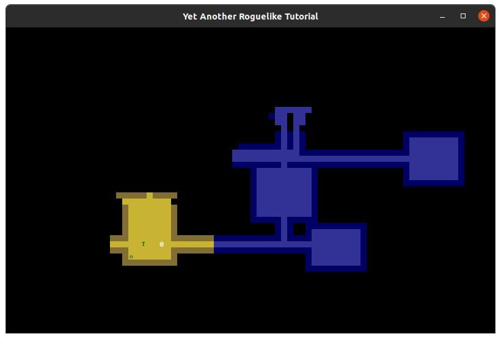

What good is a dungeon with no monsters to bash? This chapter will focus on placing the enemies throughout the dungeon, and setting them up to be attacked (the actual attacking part we'll save for next time).

Since we set up entities to be stored in the `GameMap` from the beginning, we're already well-positioned to add enemies to our dungeon. The map has direct access to the entities, and we can preserve which entities are on which floors fairly easily when we add that feature later.

Let's start by giving our entities a few more attributes they'll need. Modify `game/entity.py`:




from __future__ import annotations

from typing import Optional, Tuple

if TYPE_CHECKING:
    import game.game_map

class Entity:
    """
    A generic object to represent players, enemies, items, etc.
    """

    gamemap: game.game_map.GameMap

    def __init__(
        self,
        gamemap: Optional[game.game_map.GameMap] = None,
        x: int = 0,
        y: int = 0,
        char: str = "?",
        color: Tuple[int, int, int] = (255, 255, 255),
+       name: str = "<Unnamed>",
+       blocks_movement: bool = False,
    ):
        self.x = x
        self.y = y
        self.char = char
        self.color = color
+       self.name = name
+       self.blocks_movement = blocks_movement
        if gamemap:
            # If gamemap isn't provided now then it will be set later.
            self.gamemap = gamemap
            gamemap.entities.add(self)



<pre>from __future__ import annotations

from typing import Optional, Tuple

if TYPE_CHECKING:
    import game.game_map

class Entity:
    """
    A generic object to represent players, enemies, items, etc.
    """

    gamemap: game.game_map.GameMap

    def __init__(
        self,
        gamemap: Optional[game.game_map.GameMap] = None,
        x: int = 0,
        y: int = 0,
        char: str = "?",
        color: Tuple[int, int, int] = (255, 255, 255),
        name: str = "&lt;Unnamed&gt;",
        blocks_movement: bool = False,
    ):
        self.x = x
        self.y = y
        self.char = char
        self.color = color
        self.name = name
        self.blocks_movement = blocks_movement
        if gamemap:
            # If gamemap isn't provided now then it will be set later.
            self.gamemap = gamemap
            gamemap.entities.add(self)</pre>



We've added two new attributes to `Entity`: `name` and `blocks_movement`. `name` is straightforward: it's what the Entity is called. `blocks_movement` describes whether or not this `Entity` can be moved over or not. Enemies will have `blocks_movement` set to `True`, while in the future, things like consumable items and equipment will be set to `False`.

Now let's update our player creation in `main.py` to use these new attributes:




    tileset = tcod.tileset.load_tilesheet("data/dejavu10x10_gs_tc.png", 32, 8, tcod.tileset.CHARMAP_TCOD)

-   player = Entity(x=0, y=0, char="@", color=(255, 255, 255))
+   player = Entity(x=0, y=0, char="@", color=(255, 255, 255), name="Player", blocks_movement=True)
    engine = Engine(player=player)



<pre>    tileset = tcod.tileset.load_tilesheet("data/dejavu10x10_gs_tc.png", 32, 8, tcod.tileset.CHARMAP_TCOD)

    player = Entity(x=0, y=0, char="@", color=(255, 255, 255))
    player = Entity(x=0, y=0, char="@", color=(255, 255, 255), name="Player", blocks_movement=True)
    engine = Engine(player=player)</pre>



Now, moving on to actually placing monsters in our dungeon. Our logic will be simple enough: For each room that's created in our dungeon, we'll place a random number of enemies, between 0 and a maximum (2 for now). We'll make it so that there's an 80% chance of spawning an Orc (a weaker enemy) and a 20% chance of it being a Troll (a stronger enemy).

In order to specify the maximum number of monsters that can be spawned into a room, let's create a new variable, `max_monsters_per_room`, and place it in `main.py`. We'll also modify our call to `generate_dungeon` to pass this new variable in.




    ...
    max_rooms = 30

+   max_monsters_per_room = 2

    tileset = tcod.tileset.load_tilesheet(
        "data/dejavu10x10_gs_tc.png", 32, 8, tcod.tileset.CHARMAP_TCOD
    )

    player = Entity(x=0, y=0, char="@", color=(255, 255, 255), name="Player", blocks_movement=True)
    engine = Engine(player=player)

    engine.game_map = generate_dungeon(
        max_rooms=max_rooms,
        room_min_size=room_min_size,
        room_max_size=room_max_size,
        map_width=map_width,
        map_height=map_height,
+       max_monsters_per_room=max_monsters_per_room,
        engine=engine,
    )
    ...



<pre>    ...
    max_rooms = 30

    max_monsters_per_room = 2

    tileset = tcod.tileset.load_tilesheet(
        "data/dejavu10x10_gs_tc.png", 32, 8, tcod.tileset.CHARMAP_TCOD
    )

    player = Entity(x=0, y=0, char="@", color=(255, 255, 255), name="Player", blocks_movement=True)
    engine = Engine(player=player)

    engine.game_map = generate_dungeon(
        max_rooms=max_rooms,
        room_min_size=room_min_size,
        room_max_size=room_max_size,
        map_width=map_width,
        map_height=map_height,
        max_monsters_per_room=max_monsters_per_room,
        engine=engine,
    )
    ...</pre>



Now we'll need to modify the definition of `generate_dungeon` to take this new variable:




def generate_dungeon(
    max_rooms: int,
    room_min_size: int,
    room_max_size: int,
    map_width: int,
    map_height: int,
+   max_monsters_per_room: int,
    engine: game.engine.Engine,
) -> game.game_map.GameMap:
    """Generate a new dungeon map."""
    player = engine.player
    dungeon = GameMap(engine, map_width, map_height)



<pre>def generate_dungeon(
    max_rooms: int,
    room_min_size: int,
    room_max_size: int,
    map_width: int,
    map_height: int,
    max_monsters_per_room: int,
    engine: game.engine.Engine,
) -> game.game_map.GameMap:
    """Generate a new dungeon map."""
    player = engine.player
    dungeon = GameMap(engine, map_width, map_height)</pre>



Now let's create a function to place the entities. Add this to `game/procgen.py`:




from __future__ import annotations

from typing import TYPE_CHECKING, Iterator, List, Tuple
import random

import tcod

+from game.entity import Entity
from game.game_map import GameMap
from game.tiles import floor

if TYPE_CHECKING:
    import game.engine

class RectangularRoom:
    ...

+def place_entities(
+   room: RectangularRoom,
+   dungeon: game.game_map.GameMap,
+   maximum_monsters: int,
+) -> None:
+   number_of_monsters = random.randint(0, maximum_monsters)
+
+   for _ in range(number_of_monsters):
+       x = random.randint(room.x1 + 1, room.x2 - 1)
+       y = random.randint(room.y1 + 1, room.y2 - 1)
+
+       if not any(entity.x == x and entity.y == y for entity in dungeon.entities):
+           if random.random() < 0.8:
+               Entity(gamemap=dungeon, x=x, y=y, char="o", color=(63, 127, 63), name="Orc", blocks_movement=True)
+           else:
+               Entity(gamemap=dungeon, x=x, y=y, char="T", color=(0, 127, 0), name="Troll", blocks_movement=True)

def tunnel_between(start: Tuple[int, int], end: Tuple[int, int]) -> Iterator[Tuple[int, int]]:
    ...



<pre>from __future__ import annotations

from typing import TYPE_CHECKING, Iterator, List, Tuple
import random

import tcod

from game.entity import Entity
from game.game_map import GameMap
from game.tiles import floor

if TYPE_CHECKING:
    import game.engine

class RectangularRoom:
    ...

def place_entities(
    room: RectangularRoom,
    dungeon: game.game_map.GameMap,
    maximum_monsters: int,
) -> None:
    number_of_monsters = random.randint(0, maximum_monsters)

    for _ in range(number_of_monsters):
        x = random.randint(room.x1 + 1, room.x2 - 1)
        y = random.randint(room.y1 + 1, room.y2 - 1)

        if not any(entity.x == x and entity.y == y for entity in dungeon.entities):
            if random.random() < 0.8:
                Entity(gamemap=dungeon, x=x, y=y, char="o", color=(63, 127, 63), name="Orc", blocks_movement=True)
            else:
                Entity(gamemap=dungeon, x=x, y=y, char="T", color=(0, 127, 0), name="Troll", blocks_movement=True)

def tunnel_between(start: Tuple[int, int], end: Tuple[int, int]) -> Iterator[Tuple[int, int]]:
    ...</pre>



This function takes a random number between 0 and the provided maximum (2, in this case). It then iterates, selecting random x and y coordinates within the room. We check to make sure there's no other entity at that location before creating either an Orc (80% chance) or a Troll (20% chance). Notice how we pass the dungeon as the `gamemap` parameter when creating entities - this automatically adds them to the map's entity set.

Now let's call this function after creating each room:




        else:  # All rooms after the first.
            # Dig out a tunnel between this room and the previous one.
            for x, y in tunnel_between(rooms[-1].center, new_room.center):
                dungeon.tiles[x, y] = floor

+       place_entities(new_room, dungeon, max_monsters_per_room)

        # Finally, append the new room to the list.
        rooms.append(new_room)

    return dungeon



<pre>        else:  # All rooms after the first.
            # Dig out a tunnel between this room and the previous one.
            for x, y in tunnel_between(rooms[-1].center, new_room.center):
                dungeon.tiles[x, y] = floor

        place_entities(new_room, dungeon, max_monsters_per_room)

        # Finally, append the new room to the list.
        rooms.append(new_room)

    return dungeon</pre>



With that, your dungeon should now be populated with enemies.

They're... not exactly intimidating, are they? In fact, they don't really do much of anything right now. But that's okay, we'll work on that.

The first step towards making our monsters scarier is making them stand their ground... literally! The player can currently walk over (or under) the enemies by simply moving into the same space. Let's fix that, and ensure that when the player tries to move towards an enemy, we attack instead.

We already have a `get_blocking_entity_at_location` method from Part 2. Let's add a convenience alias for it in `game/game_map.py`:




    def get_blocking_entity_at_location(
        self,
        location_x: int,
        location_y: int,
    ) -> Optional[game.entity.Entity]:
        for entity in self.entities:
-           if entity.x == location_x and entity.y == location_y:
+           if entity.blocks_movement and entity.x == location_x and entity.y == location_y:
                return entity

        return None

+   def get_blocking_entity_at(self, x: int, y: int) -> Optional[game.entity.Entity]:
+       """Alias for get_blocking_entity_at_location"""
+       return self.get_blocking_entity_at_location(x, y)



<pre>    def get_blocking_entity_at_location(
        self,
        location_x: int,
        location_y: int,
    ) -> Optional[game.entity.Entity]:
        for entity in self.entities:
            if entity.x == location_x and entity.y == location_y:
            if entity.blocks_movement and entity.x == location_x and entity.y == location_y:
                return entity

        return None

    def get_blocking_entity_at(self, x: int, y: int) -> Optional[game.entity.Entity]:
        """Alias for get_blocking_entity_at_location"""
        return self.get_blocking_entity_at_location(x, y)</pre>



We've also updated the check to consider `blocks_movement`, so only entities that actually block movement will be returned.

Now let's enhance our action system to handle attacking. We'll modify `game/actions.py` to add some useful properties to `ActionWithDirection` and create our attack actions:




from __future__ import annotations

-from typing import TYPE_CHECKING
+from typing import TYPE_CHECKING, Optional

if TYPE_CHECKING:
    import game.engine
    import game.entity

class Action:
    ...

class EscapeAction(Action):
    def perform(self) -> None:
        raise SystemExit()

+class WaitAction(Action):
+   def perform(self) -> None:
+       pass

class ActionWithDirection(Action):
    def __init__(self, entity: game.entity.Entity, dx: int, dy: int):
        super().__init__(entity)

        self.dx = dx
        self.dy = dy

+   @property
+   def dest_xy(self) -> tuple[int, int]:
+       """Returns this actions destination."""
+       return self.entity.x + self.dx, self.entity.y + self.dy
+
+   @property
+   def blocking_entity(self) -> Optional[game.entity.Entity]:
+       """Return the blocking entity at this actions destination."""
+       return self.engine.game_map.get_blocking_entity_at(*self.dest_xy)
+
+   @property
+   def target_actor(self) -> Optional[game.entity.Entity]:
+       """Return the actor at this actions destination."""
+       return self.engine.game_map.get_blocking_entity_at(*self.dest_xy)

    def perform(self) -> None:
        raise NotImplementedError()

+class MeleeAction(ActionWithDirection):
+   def perform(self) -> None:
+       target = self.blocking_entity
+       if not target:
+           return  # No entity to attack.
+
+       print(f"You kick the {target.name}, much to its annoyance!")

class MovementAction(ActionWithDirection):
    def perform(self) -> None:
-       dest_x = self.entity.x + self.dx
-       dest_y = self.entity.y + self.dy
+       dest_x, dest_y = self.dest_xy

        if not self.engine.game_map.in_bounds(dest_x, dest_y):
            return  # Destination is out of bounds.
        if not self.engine.game_map.tiles["walkable"][dest_x, dest_y]:
            return  # Destination is blocked by a tile.
-       if self.engine.game_map.get_blocking_entity_at_location(dest_x, dest_y):
+       if self.engine.game_map.get_blocking_entity_at(dest_x, dest_y):
            return  # Destination is blocked by an entity.

        self.entity.move(self.dx, self.dy)

+class BumpAction(ActionWithDirection):
+   def perform(self) -> None:
+       if self.target_actor:
+           return MeleeAction(self.entity, self.dx, self.dy).perform()
+       else:
+           return MovementAction(self.entity, self.dx, self.dy).perform()



<pre>from __future__ import annotations

from typing import TYPE_CHECKING
from typing import TYPE_CHECKING, Optional

if TYPE_CHECKING:
    import game.engine
    import game.entity

class Action:
    ...

class EscapeAction(Action):
    def perform(self) -> None:
        raise SystemExit()

class WaitAction(Action):
    def perform(self) -> None:
        pass

class ActionWithDirection(Action):
    def __init__(self, entity: game.entity.Entity, dx: int, dy: int):
        super().__init__(entity)

        self.dx = dx
        self.dy = dy

    @property
    def dest_xy(self) -> tuple[int, int]:
        """Returns this actions destination."""
        return self.entity.x + self.dx, self.entity.y + self.dy

    @property
    def blocking_entity(self) -> Optional[game.entity.Entity]:
        """Return the blocking entity at this actions destination."""
        return self.engine.game_map.get_blocking_entity_at(*self.dest_xy)

    @property
    def target_actor(self) -> Optional[game.entity.Entity]:
        """Return the actor at this actions destination."""
        return self.engine.game_map.get_blocking_entity_at(*self.dest_xy)

    def perform(self) -> None:
        raise NotImplementedError()

class MeleeAction(ActionWithDirection):
    def perform(self) -> None:
        target = self.blocking_entity
        if not target:
            return  # No entity to attack.

        print(f"You kick the {target.name}, much to its annoyance!")

class MovementAction(ActionWithDirection):
    def perform(self) -> None:
        dest_x = self.entity.x + self.dx
        dest_y = self.entity.y + self.dy
        dest_x, dest_y = self.dest_xy

        if not self.engine.game_map.in_bounds(dest_x, dest_y):
            return  # Destination is out of bounds.
        if not self.engine.game_map.tiles["walkable"][dest_x, dest_y]:
            return  # Destination is blocked by a tile.
        if self.engine.game_map.get_blocking_entity_at_location(dest_x, dest_y):
        if self.engine.game_map.get_blocking_entity_at(dest_x, dest_y):
            return  # Destination is blocked by an entity.

        self.entity.move(self.dx, self.dy)

class BumpAction(ActionWithDirection):
    def perform(self) -> None:
        if self.target_actor:
            return MeleeAction(self.entity, self.dx, self.dy).perform()
        else:
            return MovementAction(self.entity, self.dx, self.dy).perform()</pre>



We've added properties to make our action code cleaner - `dest_xy` computes the destination coordinates, and `blocking_entity`/`target_actor` check what's at that location. `BumpAction` determines whether to move or attack based on whether there's a target at the destination.

Now let's update our input handler to use `BumpAction` instead of `MovementAction`:




import tcod.event

-from game.actions import Action, EscapeAction, MovementAction
+from game.actions import Action, BumpAction, EscapeAction, WaitAction

if TYPE_CHECKING:
    import game.engine

...

    def ev_keydown(self, event: tcod.event.KeyDown) -> Optional[ActionOrHandler]:
        action: Optional[Action] = None

        key = event.sym
+       modifiers = event.mod

        player = self.engine.player

        if key in MOVE_KEYS:
            dx, dy = MOVE_KEYS[key]
-           action = MovementAction(player, dx, dy)
+           action = BumpAction(player, dx, dy)
        elif key == tcod.event.KeySym.ESCAPE:
            action = EscapeAction(player)
+       elif key == tcod.event.KeySym.PERIOD and modifiers & (tcod.event.Modifier.LSHIFT | tcod.event.Modifier.RSHIFT):
+           # Wait if user presses '>' (shift + period)
+           action = WaitAction(player)

        # No valid key was pressed
        return action



<pre>import tcod.event

from game.actions import Action, EscapeAction, MovementAction
from game.actions import Action, BumpAction, EscapeAction, WaitAction

if TYPE_CHECKING:
    import game.engine

...

    def ev_keydown(self, event: tcod.event.KeyDown) -> Optional[ActionOrHandler]:
        action: Optional[Action] = None

        key = event.sym
        modifiers = event.mod

        player = self.engine.player

        if key in MOVE_KEYS:
            dx, dy = MOVE_KEYS[key]
            action = MovementAction(player, dx, dy)
            action = BumpAction(player, dx, dy)
        elif key == tcod.event.KeySym.ESCAPE:
            action = EscapeAction(player)
        elif key == tcod.event.KeySym.PERIOD and modifiers & (tcod.event.Modifier.LSHIFT | tcod.event.Modifier.RSHIFT):
            # Wait if user presses '>' (shift + period)
            action = WaitAction(player)

        # No valid key was pressed
        return action</pre>



We've also added a `WaitAction` that triggers when the player presses shift+period ('>'), which will be useful for letting enemies take their turn without the player moving.

Run the project now. At this point, you shouldn't be able to move over the enemies, and you should get a message in the terminal, indicating that you're attacking the enemy (albeit not for any damage).

Before we wrap this part up, let's set ourselves up to allow for enemy turns as well. They won't actually be doing anything at the moment, we'll just get a message in the terminal that indicates something is happening.

Add these small modifications to `game/engine.py`:




class Engine:
    game_map: game.game_map.GameMap

    def __init__(self, player: Entity):
        self.player = player

    def update_fov(self) -> None:
        """Recompute the visible area based on the players point of view."""
        self.game_map.visible[:] = tcod.map.compute_fov(
            self.game_map.tiles["transparent"],
            (self.player.x, self.player.y),
            radius=8,
        )
        # If a tile is "visible" it should be added to "explored".
        self.game_map.explored |= self.game_map.visible

+   def handle_enemy_turns(self) -> None:
+       for entity in set(self.game_map.entities) - {self.player}:
+           print(f"The {entity.name} wonders when it will get to take a real turn.")

    def render(self, console: tcod.console.Console) -> None:
        self.game_map.render(console)



<pre>class Engine:
    game_map: game.game_map.GameMap

    def __init__(self, player: Entity):
        self.player = player

    def update_fov(self) -> None:
        """Recompute the visible area based on the players point of view."""
        self.game_map.visible[:] = tcod.map.compute_fov(
            self.game_map.tiles["transparent"],
            (self.player.x, self.player.y),
            radius=8,
        )
        # If a tile is "visible" it should be added to "explored".
        self.game_map.explored |= self.game_map.visible

    def handle_enemy_turns(self) -> None:
        for entity in set(self.game_map.entities) - {self.player}:
            print(f"The {entity.name} wonders when it will get to take a real turn.")

    def render(self, console: tcod.console.Console) -> None:
        self.game_map.render(console)</pre>



Now we need to call this after the player takes an action. In `game/input_handlers.py`:




    def handle_action(self, action: Optional[Action]) -> bool:
        """Handle actions returned from event methods.

        Returns True if the action will advance a turn.
        """
        if action is None:
            return False

        action.perform()

+       self.engine.handle_enemy_turns()
        self.engine.update_fov()  # Update the FOV before the players next action.
        return True



<pre>    def handle_action(self, action: Optional[Action]) -> bool:
        """Handle actions returned from event methods.

        Returns True if the action will advance a turn.
        """
        if action is None:
            return False

        action.perform()

        self.engine.handle_enemy_turns()
        self.engine.update_fov()  # Update the FOV before the players next action.
        return True</pre>



The `handle_enemy_turns` function loops through each entity (minus the player) and prints out a message for them. In the next part, we'll replace this with some code that will allow those entities to take real turns.

We call `handle_enemy_turns` right after `action.perform`, so that the enemies move right after the player. Other roguelike games have more complex timing mechanisms for when entities take their turns, but our tutorial will stick with probably the simplest method of all: the player moves, then all the enemies move.

That's all for this chapter. Next time, we'll look at moving the enemies around on their turns, and doing some real damage to both the enemies and the player.

If you want to see the code so far in its entirety, [click
here](https://github.com/jmccardle/tcod_tutorial_v2/tree/part-05).

[Click here to move on to the next part of this
tutorial.](/tutorials/tcod/part-06)