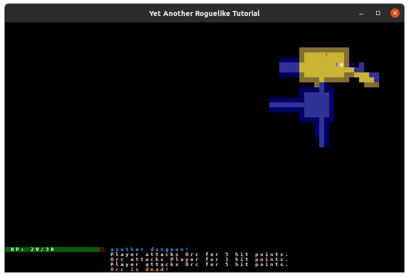
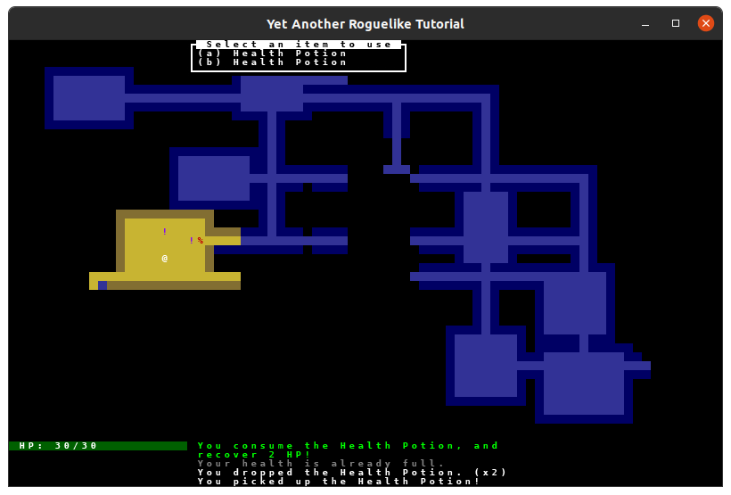

So far, our game has movement, dungeon exploring, combat, and AI (okay, we're stretching the meaning of "intelligence" in *artificial intelligence* to its limits, but bear with me here). Now it's time for another staple of the roguelike genre: items\! Why would our rogue venture into the dungeons of doom if not for some sweet loot, after all?

In this part of the tutorial, we'll achieve a few things: a working inventory, and a functioning healing potion. The next part will add more items that can be picked up, but for now, just the healing potion will suffice.

For this part, we'll need four more colors. Let's get adding those out of the way now. Open up `game/color.py` and add these colors:




white = (0xFF, 0xFF, 0xFF)
black = (0x0, 0x0, 0x0)

player_atk = (0xE0, 0xE0, 0xE0)
enemy_atk = (0xFF, 0xC0, 0xC0)

player_die = (0xFF, 0x30, 0x30)
enemy_die = (0xFF, 0xA0, 0x30)

+impossible = (0x80, 0x80, 0x80)
+invalid = (0xFF, 0xFF, 0x00)

welcome_text = (0x20, 0xA0, 0xFF)
+health_recovered = (0x0, 0xFF, 0x0)

bar_text = white
bar_filled = (0x0, 0x60, 0x0)
bar_empty = (0x40, 0x10, 0x10)



<pre>white = (0xFF, 0xFF, 0xFF)
black = (0x0, 0x0, 0x0)

player_atk = (0xE0, 0xE0, 0xE0)
enemy_atk = (0xFF, 0xC0, 0xC0)

player_die = (0xFF, 0x30, 0x30)
enemy_die = (0xFF, 0xA0, 0x30)

<span class="new-text">impossible = (0x80, 0x80, 0x80)
invalid = (0xFF, 0xFF, 0x00)</span>

welcome_text = (0x20, 0xA0, 0xFF)
<span class="new-text">health_recovered = (0x0, 0xFF, 0x0)</span>

bar_text = white
bar_filled = (0x0, 0x60, 0x0)
bar_empty = (0x40, 0x10, 0x10)</pre>



These will become useful shortly.

There's another thing we can knock out right now that we'll use later: The ability for a `Fighter` component to recover health, and the ability to take damage directly (without the defense modifier). We won't use the damage function this chapter, but since the two functions are effectively opposites, we can get writing it over with now.

Open up `game/components/fighter.py` and add these two functions:




class Fighter:
    ...
+   def heal(self, amount: int) -> int:
+       if self.hp == self.max_hp:
+           return 0

+       new_hp_value = self.hp + amount

+       if new_hp_value > self.max_hp:
+           new_hp_value = self.max_hp

+       amount_recovered = new_hp_value - self.hp

+       self.hp = new_hp_value

+       return amount_recovered

+   def take_damage(self, amount: int) -> None:
+       self.hp -= amount



<pre>class Fighter:
    ...
    <span class="new-text">def heal(self, amount: int) -> int:
        if self.hp == self.max_hp:
            return 0

        new_hp_value = self.hp + amount

        if new_hp_value > self.max_hp:
            new_hp_value = self.max_hp

        amount_recovered = new_hp_value - self.hp

        self.hp = new_hp_value

        return amount_recovered

    def take_damage(self, amount: int) -> None:
        self.hp -= amount</span></pre>



`heal` will restore a certain amount of HP, up to the maximum, and return the amount that was healed. If the entity's health is at full, then just return 0. The function that handles this should display an error if the returned amount is 0, since the entity can't be healed.

One thing we're going to need is a way to *not* consume an item or take a turn if something goes wrong during the process. For our health potion, think about what should happen if the player declares they want to use a health potion, but their health is already full. What should happen?

We could just consume the potion anyway, and have it go to waste, but if you've played a game that does that, you know how frustrating it can be, especially if the player clicked the health potion on accident. A better way would be to warn the user that they're trying to do something that makes no sense, and save the player from wasting both the potion and their turn.

But how can we achieve that? We'll discuss it a bit more later on, but the idea is that if we do something impossible, we should raise an exception. Which one? Well, we can define a custom exception, which can give us details on what happened. Create a new file called `game/exceptions.py` and put the following class into it:

```py3
class Impossible(Exception):
    """Exception raised when an action is impossible to be performed.

    The reason is given as the exception message.
    """
```

... And that's it! When we write `raise Impossible("An exception message")` in our program, the `Impossible` exception will be raised, with the given message.

So what do we do with the raised exception? Well, we should catch it! But where?

With our handler-based architecture from Part 10, exception handling is already integrated into the event processing flow. The `Impossible` exception we just created will be caught by our handler system when actions fail.

Let's update our input handlers to properly handle these exceptions. We'll modify `game/input_handlers.py`:




...
+from game.exceptions import Impossible

if TYPE_CHECKING:
    import game.engine


class EventHandler:
    ...

    def handle_action(self, action: Optional[Action]) -> bool:
        """Handle actions returned from event methods.

        Returns True if the action will advance a turn.
        """
        if action is None:
            return False

+       try:
+           action.perform()
+       except Impossible as exc:
+           self.engine.message_log.add_message(exc.args[0], color.impossible)
+           return False  # Skip enemy turn on exceptions.
-       action.perform()

        self.engine.handle_enemy_turns()
        self.engine.update_fov()
        return True




<pre>...
<span class="new-text">from game.exceptions import Impossible</span>

if TYPE_CHECKING:
    import game.engine


class EventHandler:
    ...

    def handle_action(self, action: Optional[Action]) -> bool:
        """Handle actions returned from event methods.

        Returns True if the action will advance a turn.
        """
        if action is None:
            return False

        <span class="new-text">try:
            action.perform()
        except Impossible as exc:
            self.engine.message_log.add_message(exc.args[0], color.impossible)
            return False  # Skip enemy turn on exceptions.</span>
        <span class="crossed-out-text">action.perform()</span>

        self.engine.handle_enemy_turns()
        self.engine.update_fov()
        return True</pre>



Now that we've got our event handlers updated, let's actually put the `Impossible` exception to good use. We can start by editing `game/actions.py` to make use of it when the player tries to move into an invalid area:




...
+from game.exceptions import Impossible

if TYPE_CHECKING:
    ...


class MeleeAction(ActionWithDirection):
    def perform(self) -> None:
        target = self.target_actor
        if not target:
-           return  # No entity to attack.
+           raise Impossible("Nothing to attack.")

        ...

class MovementAction(ActionWithDirection):
    def perform(self) -> None:
        dest_x, dest_y = self.dest_xy

        if not self.engine.game_map.in_bounds(dest_x, dest_y):
+           # Destination is out of bounds.
+           raise Impossible("That way is blocked.")
-           return  # Destination is out of bounds.
         if not self.engine.game_map.tiles["walkable"][dest_x, dest_y]:
+           # Destination is blocked by a tile.
+           raise Impossible("That way is blocked.")
-           return  # Destination is blocked by a tile.
         if self.engine.game_map.get_blocking_entity_at_location(dest_x, dest_y):
+           # Destination is blocked by an entity.
+           raise Impossible("That way is blocked.")
-           return  # Destination is blocked by an entity.



<pre>...
<span class="new-text">from game.exceptions import Impossible</span>

if TYPE_CHECKING:
    ...


class MeleeAction(ActionWithDirection):
    def perform(self) -> None:
        target = self.target_actor
        if not target:
            <span class="crossed-out-text">return  # No entity to attack.</span>
            <span class="new-text">raise Impossible("Nothing to attack.")</span>

        ...

class MovementAction(ActionWithDirection):
    def perform(self) -> None:
        dest_x, dest_y = self.dest_xy

        if not self.engine.game_map.in_bounds(dest_x, dest_y):
            <span class="new-text"># Destination is out of bounds.
            raise Impossible("That way is blocked.")</span>
            <span class="crossed-out-text">return  # Destination is out of bounds.</span>
         if not self.engine.game_map.tiles["walkable"][dest_x, dest_y]:
            <span class="new-text"># Destination is blocked by a tile.
            raise Impossible("That way is blocked.")</span>
            <span class="crossed-out-text">return  # Destination is blocked by a tile.</span>
         if self.engine.game_map.get_blocking_entity_at_location(dest_x, dest_y):
            <span class="new-text"># Destination is blocked by an entity.
            raise Impossible("That way is blocked.")</span>
            <span class="crossed-out-text">return  # Destination is blocked by an entity.</span></pre>



Now, if you try moving into a wall, you'll get a message in the log, and the player's turn won't be wasted.

So what about when the enemies try doing something impossible? You might want to know when that happens for debugging purposes, but during normal execution of our game, we can simply ignore it, and have the enemy skip their turn. To do this, modify `game/engine.py` like this:




...
+from game.exceptions import Impossible

...

    def handle_enemy_turns(self) -> None:
        for entity in set(self.game_map.actors) - {self.player}:
            if entity.ai:
+               try:
+                   entity.ai.perform()
+               except Impossible:
+                   pass  # Ignore impossible action exceptions from AI.
-               entity.ai.perform()



<pre>...
<span class="new-text">from game.exceptions import Impossible</span>

...

    def handle_enemy_turns(self) -> None:
        for entity in set(self.game_map.actors) - {self.player}:
            if entity.ai:
                <span class="new-text">try:
                    entity.ai.perform()
                except Impossible:
                    pass  # Ignore impossible action exceptions from AI.</span>
                <span class="crossed-out-text">entity.ai.perform()</span></pre>



This is great and all, but wasn't this chapter supposed to be about implementing items? And, yes, that's true, and we're going to transition to that now, but it'll be helpful to have a way to stop the player from wasting a turn in just a moment.

The way we'll implement our health potions will be similar to how we implemented enemies: We'll create a component that holds the functionality we want, and we'll create a subclass of `Entity` that holds the relevant component. From the `Consumable` component, we can create subclasses that implement the specific functionality we want for each item. In this case, it'll be a health potion, but in the next chapter, we'll be implementing other types of consumables, so we'll want to stay flexible.

In the `game/components` directory, create a file called `consumable.py` and fill it with the following contents:

```py3
from __future__ import annotations

from typing import TYPE_CHECKING, Optional

from game.actions import Action, ItemAction
from game.color import health_recovered
from game.components.base_component import BaseComponent
from game.exceptions import Impossible
import game.entity


class Consumable(BaseComponent):
    parent: Item

    def get_action(self, consumer: Actor) -> Optional[actions.Action]:
        """Try to return the action for this item."""
        return actions.ItemAction(consumer, self.parent)

    def activate(self, action: actions.ItemAction) -> None:
        """Invoke this items ability.

        `action` is the context for this activation.
        """
        raise NotImplementedError()


class HealingConsumable(Consumable):
    def __init__(self, amount: int):
        self.amount = amount

    def activate(self, action: actions.ItemAction) -> None:
        consumer = action.entity
        amount_recovered = consumer.fighter.heal(self.amount)

        if amount_recovered > 0:
            self.engine.message_log.add_message(
                f"You consume the {self.parent.name}, and recover {amount_recovered} HP!",
                color.health_recovered,
            )
        else:
            raise Impossible(f"Your health is already full.")
```

The `Consumable` class knows its parent, and it defines two methods: `get_action` and `activate`.

`get_action` gets `ItemAction`, which we haven't defined just yet (we will soon). Subclasses can override this to provide more information to `ItemAction` if needed, such as the position of a potential target (this will be useful when we have ranged targeting).

`activate` is just an abstract method, it's up to the subclasses to define their own implementation. The subclasses should call this method when they're trying to actually cause the effect that they've defined for themselves (healing for healing potions, damage for lightning scrolls, etc.).

`HealingConsumable` is initialized with an `amount`, which is how much the user will be healed when using the item. The `activate` function calls `fighter.heal`, and logs a message to the message log, if the entity recovered health. If not (because the user had full health already), we return that `Impossible` exception we defined earlier. This will give us a message in the log that the player's health is already full, and it won't waste the health potion.

So what does this component get attached to? In order to create our health potions, we can create another subclass of `Entity`, which will represent non-actor items. Open up `entity.py` and add the following class:




from render_order import RenderOrder

if TYPE_CHECKING:
    from components.ai import BaseAI
+   from components.consumable import Consumable
    from components.fighter import Fighter
    from game_map import GameMap

...

    ...
    @property
    def is_alive(self) -> bool:
        """Returns True as long as this actor can perform actions."""
        return bool(self.ai)


+class Item(Entity):
+   def __init__(
+       self,
+       *,
+       x: int = 0,
+       y: int = 0,
+       char: str = "?",
+       color: Tuple[int, int, int] = (255, 255, 255),
+       name: str = "<Unnamed>",
+       consumable: Consumable,
+   ):
+       super().__init__(
+           x=x,
+           y=y,
+           char=char,
+           color=color,
+           name=name,
+           blocks_movement=False,
+           render_order=RenderOrder.ITEM,
+       )

+       self.consumable = consumable
+       self.consumable.parent = self



<pre>from render_order import RenderOrder

if TYPE_CHECKING:
    from components.ai import BaseAI
    <span class="new-text">from components.consumable import Consumable</span>
    from components.fighter import Fighter
    from game_map import GameMap

...

    ...
    @property
    def is_alive(self) -> bool:
        """Returns True as long as this actor can perform actions."""
        return bool(self.ai)


<span class="new-text">class Item(Entity):
    def __init__(
        self,
        *,
        x: int = 0,
        y: int = 0,
        char: str = "?",
        color: Tuple[int, int, int] = (255, 255, 255),
        name: str = "&lt;Unnamed&gt;",
        consumable: Consumable,
    ):
        super().__init__(
            x=x,
            y=y,
            char=char,
            color=color,
            name=name,
            blocks_movement=False,
            render_order=RenderOrder.ITEM,
        )

        self.consumable = consumable
        self.consumable.parent = self</pre>



`Item` isn't too different from `Actor`, except instead of implementing `fighter` and `ai`, it does `consumable`. When we create an item, we'll assign the `consumable`, which will determine what actually happens when the item gets used.

The next thing we need to implement that we used in the `Consumable` class is the `ItemAction` class. Open up `actions.py` and put the following:




if TYPE_CHECKING:
    from engine import Engine
-   from entity import Actor, Entity
+   from entity import Actor, Entity, Item
...


class Action:
    ...


+class ItemAction(Action):
+   def __init__(
+       self, entity: Actor, item: Item, target_xy: Optional[Tuple[int, int]] = None
+   ):
+       super().__init__(entity)
+       self.item = item
+       if not target_xy:
+           target_xy = entity.x, entity.y
+       self.target_xy = target_xy

+   @property
+   def target_actor(self) -> Optional[Actor]:
+       """Return the actor at this actions destination."""
+       return self.engine.game_map.get_actor_at_location(*self.target_xy)

+   def perform(self) -> None:
+       """Invoke the items ability, this action will be given to provide context."""
+       self.item.consumable.activate(self)


class EscapeAction(Action):
    ...



<pre>if TYPE_CHECKING:
    from engine import Engine
    <span class="crossed-out-text">from entity import Actor, Entity</span>
    <span class="new-text">from entity import Actor, Entity, Item</span>
...


class Action:
    ...


<span class="new-text">class ItemAction(Action):
    def __init__(
        self, entity: Actor, item: Item, target_xy: Optional[Tuple[int, int]] = None
    ):
        super().__init__(entity)
        self.item = item
        if not target_xy:
            target_xy = entity.x, entity.y
        self.target_xy = target_xy

    @property
    def target_actor(self) -> Optional[Actor]:
        """Return the actor at this actions destination."""
        return self.engine.game_map.get_actor_at_location(*self.target_xy)

    def perform(self) -> None:
        """Invoke the items ability, this action will be given to provide context."""
        self.item.consumable.activate(self)</span>


class EscapeAction(Action):
    ...</pre>



`ItemAction` takes several arguments in its `__init__` function: `entity`, which is the entity using the item, `item`, which is the item itself, and `target_xy`, which is the x and y coordinates of the "target" of the item, if there is one. We won't actually use this in this chapter, but it'll come in handy soon.

`target_actor` gets the actor at the target location. Again, we won't actually use it this chapter, since health potions don't "target" anything.

`perform` activates the consumable, with its `activate` method we defined earlier.

To utilize our new `Item`, let's add the health potion to `entity_factories.py`:




from components.ai import HostileEnemy
+from components.consumable import HealingConsumable
from components.fighter import Fighter
-from entity import Actor
+from entity import Actor, Item


player = Actor(
    char="@",
    color=(255, 255, 255),
    name="Player",
    ai_cls=HostileEnemy,
    fighter=Fighter(hp=30, defense=2, power=5),
)

orc = Actor(
    char="o",
    color=(63, 127, 63),
    name="Orc",
    ai_cls=HostileEnemy,
    fighter=Fighter(hp=10, defense=0, power=3),
)
troll = Actor(
    char="T",
    color=(0, 127, 0),
    name="Troll",
    ai_cls=HostileEnemy,
    fighter=Fighter(hp=16, defense=1, power=4),
)

+health_potion = Item(
+   char="!",
+   color=(127, 0, 255),
+   name="Health Potion",
+   consumable=HealingConsumable(amount=4),
+)



<pre>from components.ai import HostileEnemy
<span class="new-text">from components.consumable import HealingConsumable</span>
from components.fighter import Fighter
<span class="crossed-out-text">from entity import Actor</span>
<span class="new-text">from entity import Actor, Item</span>


player = Actor(
    char="@",
    color=(255, 255, 255),
    name="Player",
    ai_cls=HostileEnemy,
    fighter=Fighter(hp=30, defense=2, power=5),
)

orc = Actor(
    char="o",
    color=(63, 127, 63),
    name="Orc",
    ai_cls=HostileEnemy,
    fighter=Fighter(hp=10, defense=0, power=3),
)
troll = Actor(
    char="T",
    color=(0, 127, 0),
    name="Troll",
    ai_cls=HostileEnemy,
    fighter=Fighter(hp=16, defense=1, power=4),
)

<span class="new-text">health_potion = Item(
    char="!",
    color=(127, 0, 255),
    name="Health Potion",
    consumable=HealingConsumable(amount=4),
)</span></pre>



We're defining a new entity type, called `health_potion` (no surprises there), and utilizing the `Item` and `HealingConsumable` classes we just wrote. The health potion will recover 4 HP of the user's health. Feel free to adjust that value however you see fit.

Alright, we're now ready to put some health potions in the dungeon. As you may have already guessed, we'll need to adjust the `generate_dungeon` and `place_entities` functions in `procgen.py` to actually put the potions in. Edit `procgen.py` like this:




def place_entities(
-   room: RectangularRoom, dungeon: GameMap, maximum_monsters: int,
+   room: RectangularRoom, dungeon: GameMap, maximum_monsters: int, maximum_items: int
) -> None:
    number_of_monsters = random.randint(0, maximum_monsters)
+   number_of_items = random.randint(0, maximum_items)

    for i in range(number_of_monsters):
        x = random.randint(room.x1 + 1, room.x2 - 1)
        y = random.randint(room.y1 + 1, room.y2 - 1)

        if not any(entity.x == x and entity.y == y for entity in dungeon.entities):
            if random.random() < 0.8:
                entity_factories.orc.spawn(dungeon, x, y)
            else:
                entity_factories.troll.spawn(dungeon, x, y)

+   for i in range(number_of_items):
+       x = random.randint(room.x1 + 1, room.x2 - 1)
+       y = random.randint(room.y1 + 1, room.y2 - 1)

+       if not any(entity.x == x and entity.y == y for entity in dungeon.entities):
+           entity_factories.health_potion.spawn(dungeon, x, y)


def tunnel_between(
    ...


def generate_dungeon(
    map_width: int,
    map_height: int,
    max_monsters_per_room: int,
+   max_items_per_room: int,
    engine: Engine,
) -> GameMap:
    """Generate a new dungeon map."""
    ...

        ...
-       place_entities(new_room, dungeon, max_monsters_per_room)
+       place_entities(new_room, dungeon, max_monsters_per_room, max_items_per_room)



<pre>def place_entities(
    <span class="crossed-out-text">room: RectangularRoom, dungeon: GameMap, maximum_monsters: int,</span>
    <span class="new-text">room: RectangularRoom, dungeon: GameMap, maximum_monsters: int, maximum_items: int</span>
) -> None:
    number_of_monsters = random.randint(0, maximum_monsters)
    <span class="new-text">number_of_items = random.randint(0, maximum_items)</span>

    for i in range(number_of_monsters):
        x = random.randint(room.x1 + 1, room.x2 - 1)
        y = random.randint(room.y1 + 1, room.y2 - 1)

        if not any(entity.x == x and entity.y == y for entity in dungeon.entities):
            if random.random() < 0.8:
                entity_factories.orc.spawn(dungeon, x, y)
            else:
                entity_factories.troll.spawn(dungeon, x, y)

    <span class="new-text">for i in range(number_of_items):
        x = random.randint(room.x1 + 1, room.x2 - 1)
        y = random.randint(room.y1 + 1, room.y2 - 1)

        if not any(entity.x == x and entity.y == y for entity in dungeon.entities):
            entity_factories.health_potion.spawn(dungeon, x, y)</span>


def tunnel_between(
    ...


def generate_dungeon(
    map_width: int,
    map_height: int,
    max_monsters_per_room: int,
    <span class="new-text">max_items_per_room: int,</span>
    engine: Engine,
) -> GameMap:
    """Generate a new dungeon map."""
    ...

        ...
        <span class="crossed-out-text">place_entities(new_room, dungeon, max_monsters_per_room)</span>
        <span class="new-text">place_entities(new_room, dungeon, max_monsters_per_room, max_items_per_room)</span></pre>



We're doing essentially the same thing we did to create our enemies: Giving a maximum possible number for the number of items in each room, selecting a random number between that and 0, and spawning the items in a random spot in the room, assuming nothing else already exists there.

Lastly, to make the health potions appear, we need to update our call in `main.py` to `generate_dungeon`, since we've added the `max_items_per_room` argument. Open up `main.py` and add the following lines:




    ...
    max_monsters_per_room = 2
+   max_items_per_room = 2

    tileset = tcod.tileset.load_tilesheet(
        "dejavu10x10_gs_tc.png", 32, 8, tcod.tileset.CHARMAP_TCOD
    )

    player = copy.deepcopy(entity_factories.player)

    engine = Engine(player=player)

    engine.game_map = generate_dungeon(
        max_rooms=max_rooms,
        room_min_size=room_min_size,
        room_max_size=room_max_size,
        map_width=map_width,
        map_height=map_height,
        max_monsters_per_room=max_monsters_per_room,
+       max_items_per_room=max_items_per_room,
        engine=engine,
    )
    ...



<pre>    ...
    max_monsters_per_room = 2
    <span class="new-text">max_items_per_room = 2</span>

    tileset = tcod.tileset.load_tilesheet(
        "dejavu10x10_gs_tc.png", 32, 8, tcod.tileset.CHARMAP_TCOD
    )

    player = copy.deepcopy(entity_factories.player)

    engine = Engine(player=player)

    engine.game_map = generate_dungeon(
        max_rooms=max_rooms,
        room_min_size=room_min_size,
        room_max_size=room_max_size,
        map_width=map_width,
        map_height=map_height,
        max_monsters_per_room=max_monsters_per_room,
        <span class="new-text">max_items_per_room=max_items_per_room,</span>
        engine=engine,
    )
    ...</pre>



Run the project now, and you should see a few health potions laying around. Success! Well, not really...



Those potions don't do our rogue any good right now, because we can't pick them up! We need to add the items to an inventory before we can start chugging them.

To implement the inventory, we can create a new component, called `Inventory`. Create a new file in the `components` directory, called `inventory.py`, and add this class:

```py3
from __future__ import annotations

from typing import List, TYPE_CHECKING

from components.base_component import BaseComponent

if TYPE_CHECKING:
    from entity import Actor, Item


class Inventory(BaseComponent):
    parent: Actor

    def __init__(self, capacity: int):
        self.capacity = capacity
        self.items: List[Item] = []

    def drop(self, item: Item) -> None:
        """
        Removes an item from the inventory and restores it to the game map, at the player's current location.
        """
        self.items.remove(item)
        item.place(self.parent.x, self.parent.y, self.gamemap)

        self.engine.message_log.add_message(f"You dropped the {item.name}.")
```

The `Inventory` class belongs to an `Actor`, and its initialized with a `capacity`, which is the maximum number of items that can be held, and the `items` list, which will actually hold the items. The `drop` method, as the name implies, will be called when the player decides to drop something out of the inventory, back onto the ground.

Let's add this new component to our `Actor` class. Open up `entity.py` and modify `Actor` like this:




...
if TYPE_CHECKING:
    from components.ai import BaseAI
    from components.consumable import Consumable
    from components.fighter import Fighter
+   from components.inventory import Inventory
    from game_map import GameMap

...
class Actor(Entity):
    def __init__(
        self,
        *,
        x: int = 0,
        y: int = 0,
        char: str = "?",
        color: Tuple[int, int, int] = (255, 255, 255),
        name: str = "<Unnamed>",
        ai_cls: Type[BaseAI],
        fighter: Fighter,
+       inventory: Inventory,
    ):
        super().__init__(
            x=x,
            y=y,
            char=char,
            color=color,
            name=name,
            blocks_movement=True,
            render_order=RenderOrder.ACTOR,
        )

        self.ai: Optional[BaseAI] = ai_cls(self)

        self.fighter = fighter
        self.fighter.parent = self

+       self.inventory = inventory
+       self.inventory.parent = self



<pre>...
if TYPE_CHECKING:
    from components.ai import BaseAI
    from components.consumable import Consumable
    from components.fighter import Fighter
    <span class="new-text">from components.inventory import Inventory</span>
    from game_map import GameMap

...
class Actor(Entity):
    def __init__(
        self,
        *,
        x: int = 0,
        y: int = 0,
        char: str = "?",
        color: Tuple[int, int, int] = (255, 255, 255),
        name: str = "&lt;Unnamed&gt;",
        ai_cls: Type[BaseAI],
        fighter: Fighter,
        <span class="new-text">inventory: Inventory,</span>
    ):
        super().__init__(
            x=x,
            y=y,
            char=char,
            color=color,
            name=name,
            blocks_movement=True,
            render_order=RenderOrder.ACTOR,
        )

        self.ai: Optional[BaseAI] = ai_cls(self)

        self.fighter = fighter
        self.fighter.parent = self

        <span class="new-text">self.inventory = inventory
        self.inventory.parent = self</span></pre>



Now, each actor will have their own inventory. Our tutorial won't implement monster inventories (they won't pick up, hold, or use items), but hopefully this setup gives you a good starting place to implement it yourself, if you so choose.

We'll need to update `entity_factories.py` to take the new component into account:




from components.ai import HostileEnemy
from components.consumable import HealingConsumable
from components.fighter import Fighter
+from components.inventory import Inventory
from entity import Actor, Item

player = Actor(
    char="@",
    color=(255, 255, 255),
    name="Player",
    ai_cls=HostileEnemy,
    fighter=Fighter(hp=30, defense=2, power=5),
+   inventory=Inventory(capacity=26),
)

orc = Actor(
    char="o",
    color=(63, 127, 63),
    name="Orc",
    ai_cls=HostileEnemy,
    fighter=Fighter(hp=10, defense=0, power=3),
+   inventory=Inventory(capacity=0),
)
troll = Actor(
    char="T",
    color=(0, 127, 0),
    name="Troll",
    ai_cls=HostileEnemy,
    fighter=Fighter(hp=16, defense=1, power=4),
+   inventory=Inventory(capacity=0),
)

health_potion = Item(
    char="!",
    color=(127, 0, 255),
    name="Health Potion",
    consumable=HealingConsumable(amount=4),
)



<pre>from components.ai import HostileEnemy
from components.consumable import HealingConsumable
from components.fighter import Fighter
<span class="new-text">from components.inventory import Inventory</span>
from entity import Actor, Item

player = Actor(
    char="@",
    color=(255, 255, 255),
    name="Player",
    ai_cls=HostileEnemy,
    fighter=Fighter(hp=30, defense=2, power=5),
    <span class="new-text">inventory=Inventory(capacity=26),</span>
)

orc = Actor(
    char="o",
    color=(63, 127, 63),
    name="Orc",
    ai_cls=HostileEnemy,
    fighter=Fighter(hp=10, defense=0, power=3),
    <span class="new-text">inventory=Inventory(capacity=0),</span>
)
troll = Actor(
    char="T",
    color=(0, 127, 0),
    name="Troll",
    ai_cls=HostileEnemy,
    fighter=Fighter(hp=16, defense=1, power=4),
    <span class="new-text">inventory=Inventory(capacity=0),</span>
)

health_potion = Item(
    char="!",
    color=(127, 0, 255),
    name="Health Potion",
    consumable=HealingConsumable(amount=4),
)</pre>



We're setting the player's inventory to 26, because when we implement the menu system, each letter in the (English) alphabet will correspond to one item slot. You can expand the inventory if you want, though you'll need to come up with an alternative menu system to accommodate having more choices.

In order to actually pick up an item of the floor, we'll require the rogue to move onto the same tile and press a key. First, we'll want an easy way to grab all the items that currently exist in the map. Open up `game_map.py` and add the following:




...
import numpy as np  # type: ignore
from tcod.console import Console

-from entity import Actor
+from entity import Actor, Item
import tile_types
...

    ...
    @property
    def actors(self) -> Iterator[Actor]:
        """Iterate over this maps living actors."""
        yield from (
            entity
            for entity in self.entities
            if isinstance(entity, Actor) and entity.is_alive
        )

+   @property
+   def items(self) -> Iterator[Item]:
+       yield from (entity for entity in self.entities if isinstance(entity, Item))

    def get_blocking_entity_at_location(
        ...



<pre>...
import numpy as np  # type: ignore
from tcod.console import Console

<span class="crossed-out-text">from entity import Actor</span>
<span class="new-text">from entity import Actor, Item</span>
import tile_types
...

    ...
    @property
    def actors(self) -> Iterator[Actor]:
        """Iterate over this maps living actors."""
        yield from (
            entity
            for entity in self.entities
            if isinstance(entity, Actor) and entity.is_alive
        )

    <span class="new-text">@property
    def items(self) -> Iterator[Item]:
        yield from (entity for entity in self.entities if isinstance(entity, Item))</span>

    def get_blocking_entity_at_location(
        ...</pre>



We can use this new property in an action to find the item(s) on the same tile as the player. Let's define a `PickupAction`, which will handle picking up the item and adding it to the inventory.

Open up `actions.py` and define `PickupAction` like this:




class Action:
    ...


+class PickupAction(Action):
+   """Pickup an item and add it to the inventory, if there is room for it."""

+   def __init__(self, entity: Actor):
+       super().__init__(entity)

+   def perform(self) -> None:
+       actor_location_x = self.entity.x
+       actor_location_y = self.entity.y
+       inventory = self.entity.inventory

+       for item in self.engine.game_map.items:
+           if actor_location_x == item.x and actor_location_y == item.y:
+               if len(inventory.items) >= inventory.capacity:
+                   raise exceptions.Impossible("Your inventory is full.")

+               self.engine.game_map.entities.remove(item)
+               item.parent = self.entity.inventory
+               inventory.items.append(item)

+               self.engine.message_log.add_message(f"You picked up the {item.name}!")
+               return

+       raise exceptions.Impossible("There is nothing here to pick up.")


class ItemAction(Action):
    ...



<pre>class Action:
    ...


<span class="new-text">class PickupAction(Action):
    """Pickup an item and add it to the inventory, if there is room for it."""

    def __init__(self, entity: Actor):
        super().__init__(entity)

    def perform(self) -> None:
        actor_location_x = self.entity.x
        actor_location_y = self.entity.y
        inventory = self.entity.inventory

        for item in self.engine.game_map.items:
            if actor_location_x == item.x and actor_location_y == item.y:
                if len(inventory.items) >= inventory.capacity:
                    raise exceptions.Impossible("Your inventory is full.")

                self.engine.game_map.entities.remove(item)
                item.parent = self.entity.inventory
                inventory.items.append(item)

                self.engine.message_log.add_message(f"You picked up the {item.name}!")
                return

        raise exceptions.Impossible("There is nothing here to pick up.")</span>


class ItemAction(Action):
    ...</pre>



The action gets the entity's location, and tries to find an item that exists in the same location, iterating through `self.engine.game_map.items` (which we just defined). If an item is found, we try to add it to the inventory, checking the capacity first, and returning `Impossible` if its full. When adding an item to the inventory, we remove it from the game map and store it in the inventory, and print out a message. We then return, since only one item can be picked up per turn (it'll be possible later for multiple items to be on the same spot).

If no item is found in the location, we just return `Impossible`, informing the player that there's nothing there.

Let's add our new action to the event handler. Open up `input_handlers.py` and edit the key checking section of `MainGameEventHandler` to add the key for picking up items:




from actions import (
    Action,
    BumpAction,
    EscapeAction,
+   PickupAction,
    WaitAction,
)
...

        ...
        elif key == tcod.event.K_v:
            self.engine.event_handler = HistoryViewer(self.engine)

+       elif key == tcod.event.K_g:
+           action = PickupAction(player)

        # No valid key was pressed
        return action



<pre>from actions import (
    Action,
    BumpAction,
    EscapeAction,
    <span class="new-text">PickupAction,</span>
    WaitAction,
)
...

        ...
        elif key == tcod.event.K_v:
            self.engine.event_handler = HistoryViewer(self.engine)

        <span class="new-text">elif key == tcod.event.K_g:
            action = PickupAction(player)</span>

        # No valid key was pressed
        return action</pre>



Simple enough, if the player presses the "g" key ("g" for "get"), we call the `PickupAction`. Run the project now, and pick up those potions!

Now that the player can pick up items, we'll need to create our inventory menu, where the player can see what items are in the inventory, and select which one to use. This will require a few steps.

First, we need a way to get input from the user. When the user opens the inventory menu, we need to get the input from the user, and if it was valid, we return to the main game's event handler, so the enemies can take their turns.

To start, let's create a new event handler, which will return to the `MainGameEventHandler` when it handles an action successfully. Open `input_handlers.py` and add the following class:




class EventHandler(tcod.event.EventDispatch[Action]):
    ...


+class AskUserEventHandler(EventHandler):
+   """Handles user input for actions which require special input."""

+   def handle_action(self, action: Optional[Action]) -> bool:
+       """Return to the main event handler when a valid action was performed."""
+       if super().handle_action(action):
+           self.engine.event_handler = MainGameEventHandler(self.engine)
+           return True
+       return False

+   def ev_keydown(self, event: tcod.event.KeyDown) -> Optional[Action]:
+       """By default any key exits this input handler."""
+       if event.sym in {  # Ignore modifier keys.
+           tcod.event.K_LSHIFT,
+           tcod.event.K_RSHIFT,
+           tcod.event.K_LCTRL,
+           tcod.event.K_RCTRL,
+           tcod.event.K_LALT,
+           tcod.event.K_RALT,
+       }:
+           return None
+       return self.on_exit()

+   def ev_mousebuttondown(self, event: tcod.event.MouseButtonDown) -> Optional[Action]:
+       """By default any mouse click exits this input handler."""
+       return self.on_exit()

+   def on_exit(self) -> Optional[Action]:
+       """Called when the user is trying to exit or cancel an action.

+       By default this returns to the main event handler.
+       """
+       self.engine.event_handler = MainGameEventHandler(self.engine)
+       return None



<pre>class EventHandler(tcod.event.EventDispatch[Action]):
    ...


<span class="new-text">class AskUserEventHandler(EventHandler):
    """Handles user input for actions which require special input."""

    def handle_action(self, action: Optional[Action]) -> bool:
        """Return to the main event handler when a valid action was performed."""
        if super().handle_action(action):
            self.engine.event_handler = MainGameEventHandler(self.engine)
            return True
        return False

    def ev_keydown(self, event: tcod.event.KeyDown) -> Optional[Action]:
        """By default any key exits this input handler."""
        if event.sym in {  # Ignore modifier keys.
            tcod.event.K_LSHIFT,
            tcod.event.K_RSHIFT,
            tcod.event.K_LCTRL,
            tcod.event.K_RCTRL,
            tcod.event.K_LALT,
            tcod.event.K_RALT,
        }:
            return None
        return self.on_exit()

    def ev_mousebuttondown(self, event: tcod.event.MouseButtonDown) -> Optional[Action]:
        """By default any mouse click exits this input handler."""
        return self.on_exit()

    def on_exit(self) -> Optional[Action]:
        """Called when the user is trying to exit or cancel an action.

        By default this returns to the main event handler.
        """
        self.engine.event_handler = MainGameEventHandler(self.engine)
        return None</span></pre>



`AskUserEventHandler`, by default, just exits itself when any key is pressed, besides one of the "modifier" keys (shift, control, and alt). It also exits when clicking the mouse.

What's the point of this class? By itself, nothing really. But we can create subclasses of it that actually do something useful, which is what we'll do now. Let's keep editing `input_handlers.py` and add this class:




if TYPE_CHECKING:
    from engine import Engine
+   from entity import Item
...


class AskUserEventHandler(EventHandler):
    ...


+class InventoryEventHandler(AskUserEventHandler):
+   """This handler lets the user select an item.

+   What happens then depends on the subclass.
+   """

+   TITLE = "<missing title>"

+   def on_render(self, console: tcod.Console) -> None:
+       """Render an inventory menu, which displays the items in the inventory, and the letter to select them.
+       Will move to a different position based on where the player is located, so the player can always see where
+       they are.
+       """
+       super().on_render(console)
+       number_of_items_in_inventory = len(self.engine.player.inventory.items)

+       height = number_of_items_in_inventory + 2

+       if height <= 3:
+           height = 3

+       if self.engine.player.x <= 30:
+           x = 40
+       else:
+           x = 0

+       y = 0

+       width = len(self.TITLE) + 4

+       console.draw_frame(
+           x=x,
+           y=y,
+           width=width,
+           height=height,
+           title=self.TITLE,
+           clear=True,
+           fg=(255, 255, 255),
+           bg=(0, 0, 0),
+       )

+       if number_of_items_in_inventory > 0:
+           for i, item in enumerate(self.engine.player.inventory.items):
+               item_key = chr(ord("a") + i)
+               console.print(x + 1, y + i + 1, f"({item_key}) {item.name}")
+       else:
+           console.print(x + 1, y + 1, "(Empty)")

+   def ev_keydown(self, event: tcod.event.KeyDown) -> Optional[Action]:
+       player = self.engine.player
+       key = event.sym
+       index = key - tcod.event.K_a

+       if 0 <= index <= 26:
+           try:
+               selected_item = player.inventory.items[index]
+           except IndexError:
+               self.engine.message_log.add_message("Invalid entry.", color.invalid)
+               return None
+           return self.on_item_selected(selected_item)
+       return super().ev_keydown(event)

+   def on_item_selected(self, item: Item) -> Optional[Action]:
+       """Called when the user selects a valid item."""
+       raise NotImplementedError()



<pre>if TYPE_CHECKING:
    from engine import Engine
    <span class="new-text">from entity import Item</span>
...


class AskUserEventHandler(EventHandler):
    ...


<span class="new-text">class InventoryEventHandler(AskUserEventHandler):
    """This handler lets the user select an item.

    What happens then depends on the subclass.
    """

    TITLE = "&lt;missing title&gt;"

    def on_render(self, console: tcod.Console) -> None:
        """Render an inventory menu, which displays the items in the inventory, and the letter to select them.
        Will move to a different position based on where the player is located, so the player can always see where
        they are.
        """
        super().on_render(console)
        number_of_items_in_inventory = len(self.engine.player.inventory.items)

        height = number_of_items_in_inventory + 2

        if height <= 3:
            height = 3

        if self.engine.player.x <= 30:
            x = 40
        else:
            x = 0

        y = 0

        width = len(self.TITLE) + 4

        console.draw_frame(
            x=x,
            y=y,
            width=width,
            height=height,
            title=self.TITLE,
            clear=True,
            fg=(255, 255, 255),
            bg=(0, 0, 0),
        )

        if number_of_items_in_inventory > 0:
            for i, item in enumerate(self.engine.player.inventory.items):
                item_key = chr(ord("a") + i)
                console.print(x + 1, y + i + 1, f"({item_key}) {item.name}")
        else:
            console.print(x + 1, y + 1, "(Empty)")

    def ev_keydown(self, event: tcod.event.KeyDown) -> Optional[Action]:
        player = self.engine.player
        key = event.sym
        index = key - tcod.event.K_a

        if 0 <= index <= 26:
            try:
                selected_item = player.inventory.items[index]
            except IndexError:
                self.engine.message_log.add_message("Invalid entry.", color.invalid)
                return None
            return self.on_item_selected(selected_item)
        return super().ev_keydown(event)

    def on_item_selected(self, item: Item) -> Optional[Action]:
        """Called when the user selects a valid item."""
        raise NotImplementedError()</span></pre>



`InventoryEventHandler` subclasses `AskUserEventHandler`, and renders the items within the player's `Inventory`. Depending on where the player is standing, the menu will render off to the side, so the menu won't cover the player. If there's nothing in the inventory, it just prints "Empty". Notice that it doesn't give itself a title, as that will be defined in a different subclass (more on that in a bit).

The `ev_keydown` function takes the user's input, from letters a - z, and associates that with an index in the inventory. If the player pressed "b", for example, the second item in the inventory will be selected and returned. If the player presses a key like "c" (item 3) but only has one item, then the message "Invalid entry" will display. If any other key is pressed, the menu will close.

This class, still, does not actually do anything for us right now, but I promise we're close. Before we implement the menus to use and drop items, we'll need to define the `Action` that drops items. Add the following class to `actions.py`:




class EscapeAction(Action):
    def perform(self) -> None:
        raise SystemExit()


+class DropItem(ItemAction):
+   def perform(self) -> None:
+       self.entity.inventory.drop(self.item)


class WaitAction(Action):
    def perform(self) -> None:
        pass
...



<pre>class EscapeAction(Action):
    def perform(self) -> None:
        raise SystemExit()


<span class="new-text">class DropItem(ItemAction):
    def perform(self) -> None:
        self.entity.inventory.drop(self.item)</span>


class WaitAction(Action):
    def perform(self) -> None:
        pass
...</pre>



`DropItem` will be used to drop something from the inventory. It just calls the `drop` method of the `Inventory` component.

Now, let's put this new action into... well... action! Open up `input_handlers.py` once again, and let's add the handlers that will handle both selecting an item and dropping one.




...
import tcod

+import actions
from actions import (
    Action,
    BumpAction,
    EscapeAction,
    PickupAction,
    WaitAction,
)
...


class InventoryEventHandler(AskUserEventHandler):
    ...


+class InventoryActivateHandler(InventoryEventHandler):
+   """Handle using an inventory item."""

+   TITLE = "Select an item to use"

+   def on_item_selected(self, item: Item) -> Optional[Action]:
+       """Return the action for the selected item."""
+       return item.consumable.get_action(self.engine.player)


+class InventoryDropHandler(InventoryEventHandler):
+   """Handle dropping an inventory item."""

+   TITLE = "Select an item to drop"

+   def on_item_selected(self, item: Item) -> Optional[Action]:
+       """Drop this item."""
+       return actions.DropItem(self.engine.player, item)



<pre>...
import tcod

<span class="new-text">import actions</span>
from actions import (
    Action,
    BumpAction,
    EscapeAction,
    PickupAction,
    WaitAction,
)
...


class InventoryEventHandler(AskUserEventHandler):
    ...


<span class="new-text">class InventoryActivateHandler(InventoryEventHandler):
    """Handle using an inventory item."""

    TITLE = "Select an item to use"

    def on_item_selected(self, item: Item) -> Optional[Action]:
        """Return the action for the selected item."""
        return item.consumable.get_action(self.engine.player)


class InventoryDropHandler(InventoryEventHandler):
    """Handle dropping an inventory item."""

    TITLE = "Select an item to drop"

    def on_item_selected(self, item: Item) -> Optional[Action]:
        """Drop this item."""
        return actions.DropItem(self.engine.player, item)</span></pre>



At long last, we've got the `InventoryActivateHandler` and the `InventoryDropHandler`, which will handle using and dropping items, respectively. They both inherit from `InventoryEventHandler`, allowing the player to select an item in both menus using what we wrote in that class (selecting an item with a letter), but both handlers display a different title and call different actions, depending on the selection.

All that's left now is to utilize these event handlers, based on the key we press. Let's set the game up to open the inventory menu when pressing "i", and the drop menu when pressing "d". Open `input_handlers.py`, and add the following lines to `MainGameEventHandler`:




        ...
        elif key == tcod.event.K_g:
            action = PickupAction(player)

+       elif key == tcod.event.K_i:
+           self.engine.event_handler = InventoryActivateHandler(self.engine)
+       elif key == tcod.event.K_d:
+           self.engine.event_handler = InventoryDropHandler(self.engine)

        # No valid key was pressed
        return action



<pre>        ...
        elif key == tcod.event.K_g:
            action = PickupAction(player)

        <span class="new-text">elif key == tcod.event.K_i:
            self.engine.event_handler = InventoryActivateHandler(self.engine)
        elif key == tcod.event.K_d:
            self.engine.event_handler = InventoryDropHandler(self.engine)</span>

        # No valid key was pressed
        return action</pre>



Now, when you run the project, you can, at long last, use and drop the health potions!



There's a major bug with our implementation though: used items won't disappear after using them. This means the player could keep consuming the same health potion over and over!

Let's fix that, by opening up `consumable.py` and add the following:




from __future__ import annotations

from typing import Optional, TYPE_CHECKING

import actions
import color
+import components.inventory
from components.base_component import BaseComponent
from exceptions import Impossible

if TYPE_CHECKING:
    from entity import Actor, Item


class Consumable(BaseComponent):
    parent: Item

    def get_action(self, consumer: Actor) -> Optional[actions.Action]:
        """Try to return the action for this item."""
        return actions.ItemAction(consumer, self.parent)

    def activate(self, action: actions.ItemAction) -> None:
        """Invoke this items ability.

        `action` is the context for this activation.
        """
        raise NotImplementedError()

+   def consume(self) -> None:
+       """Remove the consumed item from its containing inventory."""
+       entity = self.parent
+       inventory = entity.parent
+       if isinstance(inventory, components.inventory.Inventory):
+           inventory.items.remove(entity)


class HealingConsumable(Consumable):
    def __init__(self, amount: int):
        self.amount = amount

    def activate(self, action: actions.ItemAction) -> None:
        consumer = action.entity
        amount_recovered = consumer.fighter.heal(self.amount)

        if amount_recovered > 0:
            self.engine.message_log.add_message(
                f"You consume the {self.parent.name}, and recover {amount_recovered} HP!",
                color.health_recovered,
            )
+           self.consume()
        else:
            raise Impossible(f"Your health is already full.")



<pre>from __future__ import annotations

from typing import Optional, TYPE_CHECKING

import actions
import color
<span class="new-text">import components.inventory</span>
from components.base_component import BaseComponent
from exceptions import Impossible

if TYPE_CHECKING:
    from entity import Actor, Item


class Consumable(BaseComponent):
    parent: Item

    def get_action(self, consumer: Actor) -> Optional[actions.Action]:
        """Try to return the action for this item."""
        return actions.ItemAction(consumer, self.parent)

    def activate(self, action: actions.ItemAction) -> None:
        """Invoke this items ability.

        `action` is the context for this activation.
        """
        raise NotImplementedError()

    <span class="new-text">def consume(self) -> None:
        """Remove the consumed item from its containing inventory."""
        entity = self.parent
        inventory = entity.parent
        if isinstance(inventory, components.inventory.Inventory):
            inventory.items.remove(entity)</span>


class HealingConsumable(Consumable):
    def __init__(self, amount: int):
        self.amount = amount

    def activate(self, action: actions.ItemAction) -> None:
        consumer = action.entity
        amount_recovered = consumer.fighter.heal(self.amount)

        if amount_recovered > 0:
            self.engine.message_log.add_message(
                f"You consume the {self.parent.name}, and recover {amount_recovered} HP!",
                color.health_recovered,
            )
            <span class="new-text">self.consume()</span>
        else:
            raise Impossible(f"Your health is already full.")</pre>



`consume` removes the item from the `Inventory` container it occupies. Since it no longer belongs to the inventory or the map, it disappears from the game. We use the `consume` method when the health potion is successfully used, and we don't if it's not.

With that, the health potions will disappear after use.

There's two last bits of housekeeping we need to do before moving on to the next part. The `parent` class attribute in the `Entity` class has a bit of a problem: it's designated as a `GameMap` type right now, but when an item moves from the map to the inventory, that isn't really true any more. Let's fix that now:




from __future__ import annotations

import copy
-from typing import Optional, Tuple, Type, TypeVar, TYPE_CHECKING
+from typing import Optional, Tuple, Type, TypeVar, TYPE_CHECKING, Union

from render_order import RenderOrder

...
class Entity:
    """
    A generic object to represent players, enemies, items, etc.
    """

-   parent: GameMap
+   parent: Union[GameMap, Inventory]

    def __init__(
        ...



<pre>from __future__ import annotations

import copy
<span class="crossed-out-text">from typing import Optional, Tuple, Type, TypeVar, TYPE_CHECKING</span>
<span class="new-text">from typing import Optional, Tuple, Type, TypeVar, TYPE_CHECKING, Union</span>

from render_order import RenderOrder

...
class Entity:
    """
    A generic object to represent players, enemies, items, etc.
    """

    <span class="crossed-out-text">parent: GameMap</span>
    <span class="new-text">parent: Union[GameMap, Inventory]</span>

    def __init__(
        ...</pre>



Lastly, we can actually remove `EscapeAction`, as it can just be handled by the event handlers. Open `actions.py` and remove `EscapeAction`:




class PickupAction(Action):
    ...


-class EscapeAction(Action):
-   def perform(self) -> None:
-       raise SystemExit()


class ItemAction(Action):
    ...



<pre>class PickupAction(Action):
    ...


<span class="crossed-out-text">class EscapeAction(Action):</span>
    <span class="crossed-out-text">def perform(self) -> None:</span>
        <span class="crossed-out-text">raise SystemExit()</span>


class ItemAction(Action):
    ...</pre>



Then, remove `EscapeAction` from `input_handlers.py`:




...
from actions import (
    Action,
    BumpAction,
-   EscapeAction,
    PickupAction,
    WaitAction
)
...

        ...
        elif key == tcod.event.K_ESCAPE:
-           action = EscapeAction(player)
+           raise SystemExit()
        elif key == tcod.event.K_v:
            self.engine.event_handler = HistoryViewer(self.engine)
        ...



<pre>...
from actions import (
    Action,
    BumpAction,
    <span class="crossed-out-text">EscapeAction,</span>
    PickupAction,
    WaitAction
)
...

        ...
        elif key == tcod.event.K_ESCAPE:
            <span class="crossed-out-text">action = EscapeAction(player)</span>
            <span class="new-text">raise SystemExit()</span>
        elif key == tcod.event.K_v:
            self.engine.event_handler = HistoryViewer(self.engine)
        ...</pre>



This was another long chapter, but this is an important step towards a functioning game. Next chapter, we'll add a few more item types to use.

If you want to see the code so far in its entirety, [click here](https://github.com/TStand90/tcod_tutorial_v2/tree/2020/part-8).

[Click here to move on to the next part of this tutorial.](/tutorials/tcod/v2/part-9)
